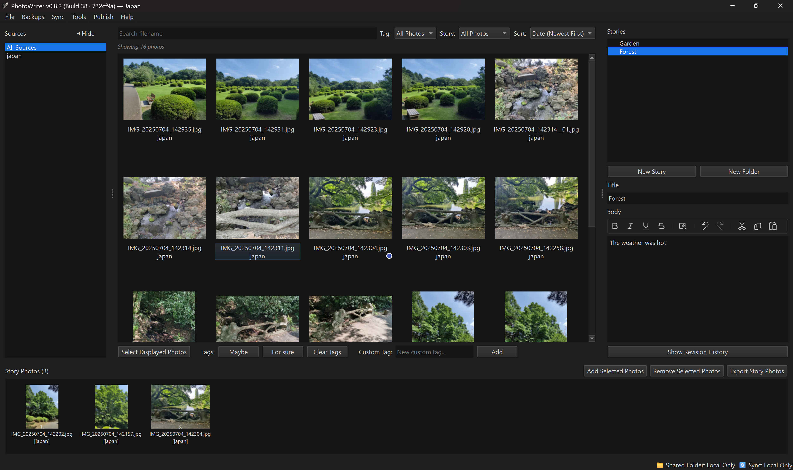

# PhotoWriter

**Turn your photo library into stories.**

PhotoWriter is a local-first Windows desktop app for selecting, organizing, writing, and sharing stories from large photo collections.

## Download

👉 **[Download the Latest Version](../..releases/latest)**

- **OS**: Windows 10 / 11 (64-bit)
- **Installer**: Standard Windows Setup (`PhotoWriter_Setup_x.x.x.exe`)
- **Requirements**: No account, cloud subscription, or internet connection required for core workflow.

---

## About

PhotoWriter was created for the part of photography that happens *after* the trip: going through thousands of photos, deciding which ones tell the story, and actually putting that narrative together.

It is built from the ground up around a **local-first workflow** — your original high-resolution photos and metadata remain privately on your computer.

---

## Features

- 📷 **High-Volume Photo Management**: Fast browsing, filtering, and non-destructive indexing of large RAW and JPEG libraries.
- ✍️ **Story Writing & Editorial Curation**: Pair your photos with formatted text narratives and arrange visual sequences.
- 🖼️ **Full-Resolution Lightbox**: Detailed zoom inspection with fast, local preview caching.
- 🔄 **Multi-Device Synchronization**: Collaborate across computers or keep your laptop and desktop in sync via shared folders (OneDrive, Dropbox, Google Drive, NAS).
- 📤 **Direct Publishing**: Broadcast formatted photo albums and stories directly to Telegram channels and groups.
- 🔒 **100% Local & Private**: Your photo library is never uploaded or modified on disk.

---

## Releases & Changelog

This repository hosts official compiled releases of PhotoWriter.

See the **[Releases Tab](../../releases)** for the latest installer packages and release notes.

---

## Support & Feedback

Found a bug or have a feature suggestion?
- [Open an Issue](../../issues)
- Please check existing issues before submitting a new report.

---

## License

PhotoWriter is proprietary software. All rights reserved. See [LICENSE](LICENSE) for details.
